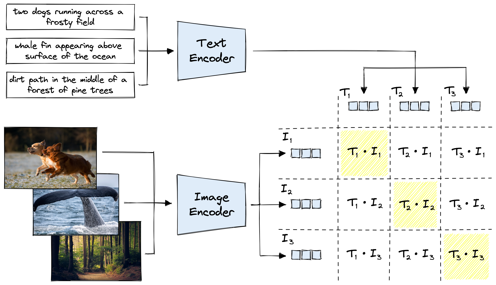
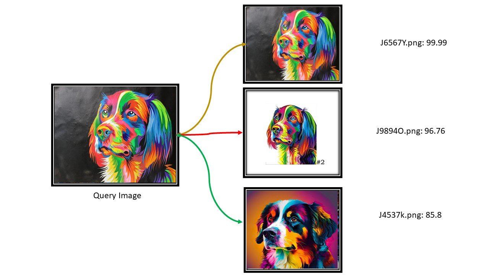

# CLIP_Image_Retrieval
Image/Instance Retrieval using CLIP, A self supervised Learning Model

### Image Similarity

## Check out My DinoV2 implementation for Image search [here](https://github.com/purnasai/Dino_V2)

This Repository contained:
- Image Retrival with `Image` as a querry
- Image Retrival with `Text` as a querry

#### Notes:
- Paralell Processing is not required at Faiss Search Time, since Faiss Already implements it.
- Paralell Processing at Feature creation for Database images is helpful.
- We are currently using Faiss.IndexL2 with Normalized Vectors which is Cosine Similarity, But IVFPQ(Inverted File pointer Quantization) + HNSW Of FAISS can Search Billions Of Points in MilliSeconds & Can be added Later.
- save & load model from locally to quick run.
